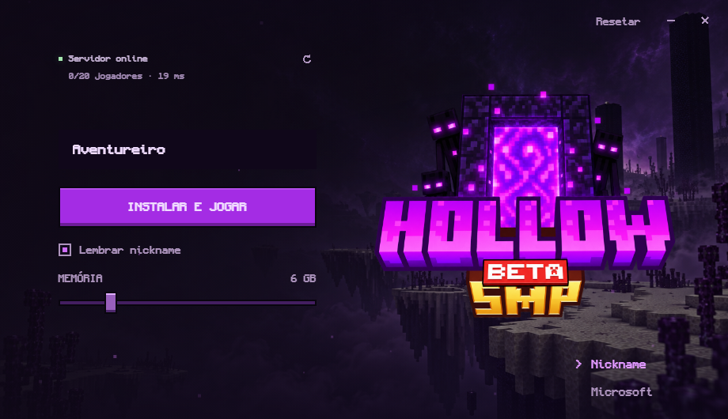

<p align="center"></p>
<h1 align="center">Hollow Launcher</h1>
<p align="center">Launcher Electron do Hollow SMP para Windows.<br>Instalação automática, visual pixelado e modpack pelo AutoModpack.</p>
<p align="center">  </p>



O fundo usa a paisagem Minecraft fornecida pelo responsável do Hollow, com escurecimento para leitura, névoa e partículas discretas. O painel consulta o servidor diretamente: números na captura são ilustrativos e variam na execução.

## Baixar e jogar

Baixe o ZIP na página de [Releases](https://github.com/KaueBerto/hollow-launcher/releases/latest), extraia e abra `HollowSMP-Launcher.exe`. Também é possível baixar o executável portátil da release diretamente.

1. Escolha **Nickname** ou **Microsoft** e ajuste a memória.
2. Clique em **Instalar e jogar** e aguarde a preparação inicial.
3. Abra **Multijogador** e entre no **Hollow SMP**.
4. Confirme o download do modpack pelo AutoModpack. Se ele pedir reinício, feche o Minecraft, abra pelo launcher e conecte novamente.

A primeira preparação baixa Java 21, Minecraft 1.21.1, NeoForge 21.1.253 e recursos do jogo. Pode levar vários minutos. Nas próximas aberturas, o launcher reutiliza a instalação. O modpack é recebido **dentro do Minecraft**, ao entrar no servidor; a barra do launcher mostra a preparação da base.

O repositório é privado. Para jogadores sem acesso ao GitHub, compartilhe o ZIP por seu canal de downloads.

## Versão Electron

A versão 2.0 substitui a interface Windows Forms por HTML, CSS e JavaScript, com motor de instalação em Node.js. Não usa um executável C# como backend.

- Cores roxas da logo, fonte Monocraft em negrito e controles superiores sem borda.
- Flutuação suave da logo com animação CSS por `transform`, pausada ao ocultar a janela. Respeita a preferência do sistema por movimento reduzido.
- Entrada suave da interface, brilho discreto e pressão nos botões, troca animada de conta, progresso e avisos com transições. Animações não deslocam o layout final nem bloqueiam os controles.
- Paisagem Minecraft, névoa e 18 partículas quadradas, com movimento reduzido e pausa ao ocultar.
- Brilho do portal ao clicar em Jogar e durante a preparação.
- Status Java direto, jogadores e ping por pong, atualização a cada 45 segundos enquanto visível e botão para atualizar. Falha de consulta mostra **Sem resposta**, permite jogar e não inventa estado offline.
- Memória de 2 a 24 GB por arraste ou teclado.
- Reset com confirmação e preparação automática da nova instalação.
- Launcher escondido enquanto o Minecraft está aberto, retornando ao fechar o jogo.
- Atividade fixa **Jogando HollowSMP** no Discord enquanto o launcher estiver aberto, inclusive escondido. Reconecta se o Discord abrir depois e limpa ao sair: [configuração](docs/DISCORD.md).
- Downloads HTTPS, hashes, tentativas automáticas e até 12 recursos em paralelo.
- Janela isolada: Node desabilitado na interface, sandbox e API limitada no preload.

A pasta `%LOCALAPPDATA%\HollowSMP` e as preferências da versão 1.x são reaproveitadas. **Feche o launcher antigo antes de usar o novo.** O Electron inclui Chromium: o executável e o consumo de memória são maiores que na versão C#.

## Contas

| Modo | Funcionamento |
| --- | --- |
| Nickname | Inicia diretamente com um nome de 3 a 16 letras, números ou `_`. Não autentica uma conta Microsoft; a entrada depende de o servidor permitir esse modo. |
| Microsoft | Autoriza a conta no navegador e inicia o Minecraft diretamente pelo Hollow. Exige acesso ativo ao Minecraft Java e cadastro do aplicativo aprovado. |

O launcher oficial não é necessário. O Hollow usa OAuth com PKCE no navegador do sistema, valida o acesso ao Minecraft Java e utiliza seu nome e UUID oficiais. O refresh token é protegido pelo Windows via Electron `safeStorage`; senha e access tokens não são salvos na conta. **Sair da conta** remove a sessão salva. O botão **Cancelar login** encerra a autorização em andamento.

**Integração em prévia:** o Client ID do Hollow ainda não foi fornecido/aprovado. Sem esse cadastro, Microsoft exibe uma mensagem de configuração pendente antes de baixar o jogo. Nickname continua funcionando. O login com uma conta real só poderá ser validado após a aprovação. Consulte [o cadastro Microsoft](docs/MICROSOFT.md).

A autenticação do servidor é responsabilidade da configuração da VPS. Este projeto não altera essas regras.

## Resetar

O botão **Resetar** pede confirmação e apaga `%LOCALAPPDATA%\HollowSMP`, incluindo mods, configurações, mundos locais, screenshots, logs, Java e preferências. **A exclusão não pode ser desfeita.** Faça backup do que deseja guardar.

Depois, a base do jogo é preparada novamente. Entre no servidor para receber o modpack. O reset preserva o servidor e os perfis e bibliotecas compartilhados do launcher oficial.

Feche Minecraft e outros programas Java antes. O reset recusa processos `java`/`javaw`, arquivos ocupados e links de arquivos ou pastas. Os controles ficam desabilitados durante instalação e reset.

## Requisitos

- Windows 10 ou 11 de 64 bits.
- Internet, espaço para o jogo/modpack e memória suficiente para o pack.
- Conta com Minecraft Java para Microsoft, e aplicativo Hollow registrado/aprovado.

O jogador não precisa instalar Node.js, Electron, Java ou um SDK. A barra de RAM não verifica a capacidade física: deixe memória livre para Windows e outros programas.

## Desenvolver e compilar

Use Node.js 24 LTS e npm em Windows x64. As versões de dependências são fixadas no `package-lock.json`.

```powershell
npm ci
npm start
npm test
npm run test:ui
npm run build
npm run package
```

`build` gera `dist/HollowSMP-Launcher-2.1.0-rc.6.exe`, um executável portátil. `package` gera `dist/HollowSMP-Launcher-Windows.zip`, instruções, licenças e `SHA256.txt`. O empacotamento usa electron-builder e não exige Visual Studio ou compilador C#.

O executável não possui certificado de assinatura de código do Hollow. Para uma distribuição assinada, configure seu certificado no electron-builder.

## Estrutura

```text
src/main.cjs       Janela Electron, estado e IPC
src/preload.cjs    API limitada exposta à interface
src/game-window.cjs Visibilidade e acompanhamento do jogo
src/engine.cjs     Instalação, reset, perfis e inicialização do jogo
src/microsoft-auth.cjs Login Microsoft, sessão protegida e perfil Java
src/microsoft-config.cjs Client ID público próprio do Hollow (pendente)
src/server-status.cjs Consulta Java, ping, cache e atualização do painel
renderer/         HTML, CSS, eventos e animação
assets/           Logo, ícone, fontes e AutoModpack original
scripts/          Smoke test, integração opcional e distribuição
tests/           Testes isolados do motor (sem dados do jogador)
licenses/         Licenças de dependências distribuídas
docs/             Guia, preview e validação
dist/             Arquivos gerados, ignorados pelo Git
```

Versões do jogo e servidor ficam em `src/engine.cjs`. O layout está em `renderer/style.css`. As versões C# anteriores continuam disponíveis nas tags 1.x do GitHub.

## Verificações e problemas

`npm test` verifica UUID, manifestos, caminhos, preferências, reset, arquivos ocupados, junctions, ZIPs, downloads e autenticação Microsoft simulada. `npm run test:ui` abre a interface em renderização isolada, testa os controles e a criptografia Windows, e gera screenshots. Todos os dados de teste ficam em `dist/`.

A integração opcional `node scripts/verify-engine.cjs <pasta>` prepara o jogo e abre um cliente de teste. Ela exige uma pasta isolada chamada `electron-install-test` ou `runtime-download-test`, e encerra apenas o cliente que iniciou. Não use a instalação do jogador.

Logs: `%LOCALAPPDATA%\HollowSMP\launcher-error.log`, `neoforge-install.log`, `game-launch.log` e `game\logs`. Instalações interrompidas reaproveitam arquivos verificados quando você tenta novamente. Consulte [a validação](docs/VALIDACAO.md) para os testes e limites.

## Créditos

Monocraft é inspirada no Minecraft, **não a fonte oficial**. AutoModpack, Electron, Chromium e adm-zip mantêm suas licenças; veja [THIRD-PARTY.txt](THIRD-PARTY.txt) e [licenses/](licenses/). O pacote também inclui os avisos de terceiros do Chromium.

O código original e a identidade visual do Hollow SMP não recebem licença de reutilização neste repositório. As licenças de terceiros se aplicam aos respectivos componentes.

Projeto independente do Hollow SMP, sem vínculo oficial com Mojang ou Microsoft.
## Enquanto o Minecraft está aberto

O Hollow se esconde ao iniciar o Minecraft diretamente, em ambos os modos, e volta quando o jogo encerra. Para abrir o Hollow durante a partida, use o ícone perto do relógio: clique duas vezes ou escolha **Mostrar launcher**. Abrir o executável novamente também traz a janela existente.
